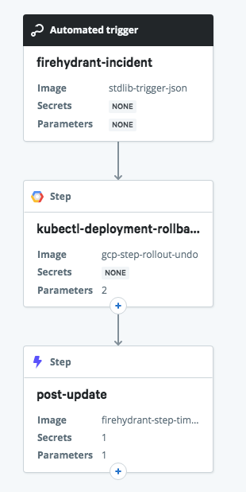
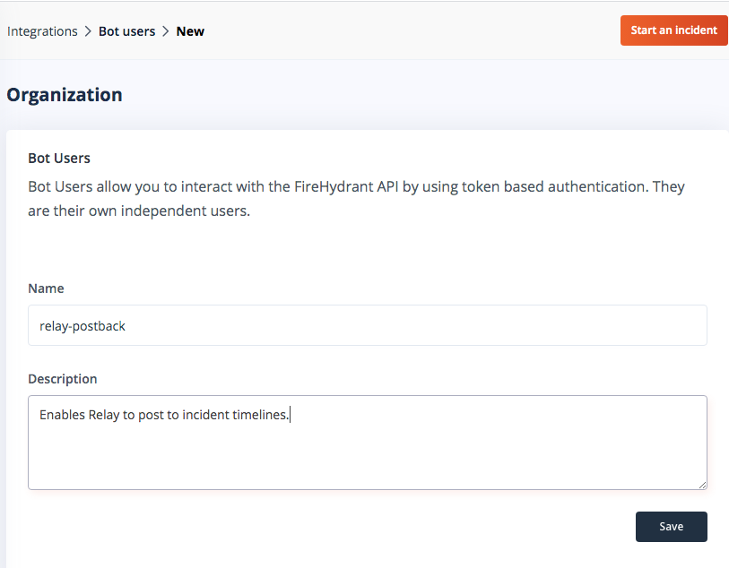
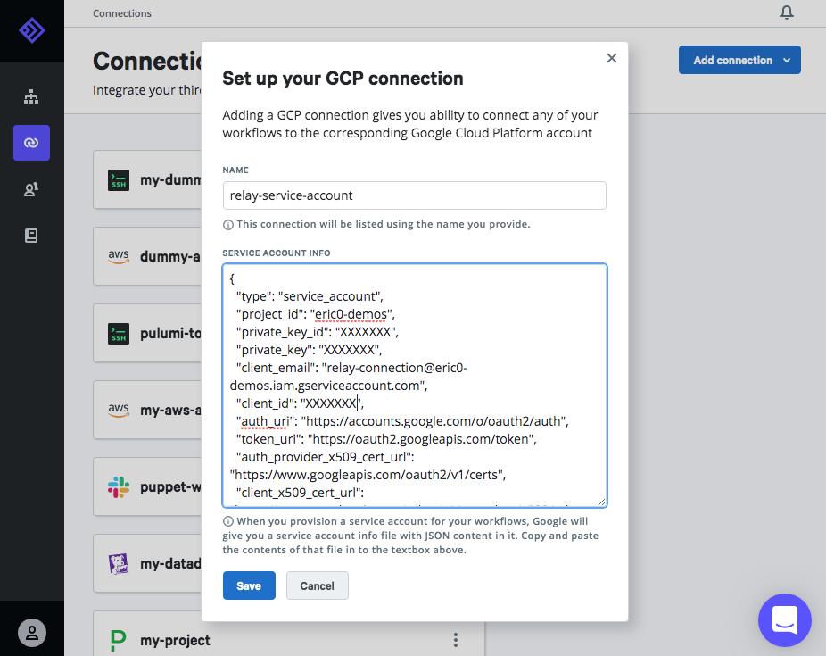
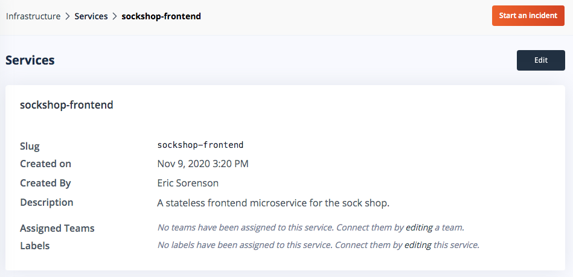
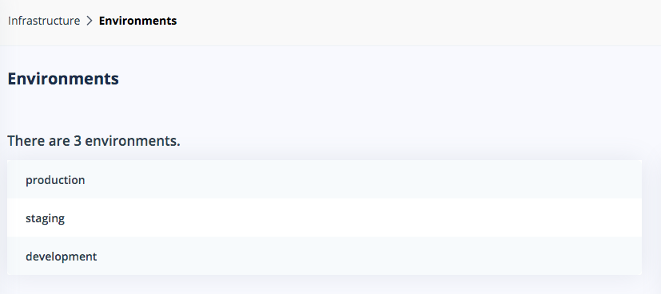
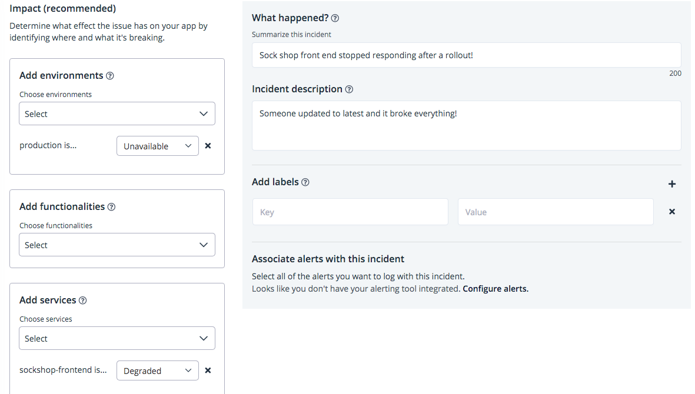
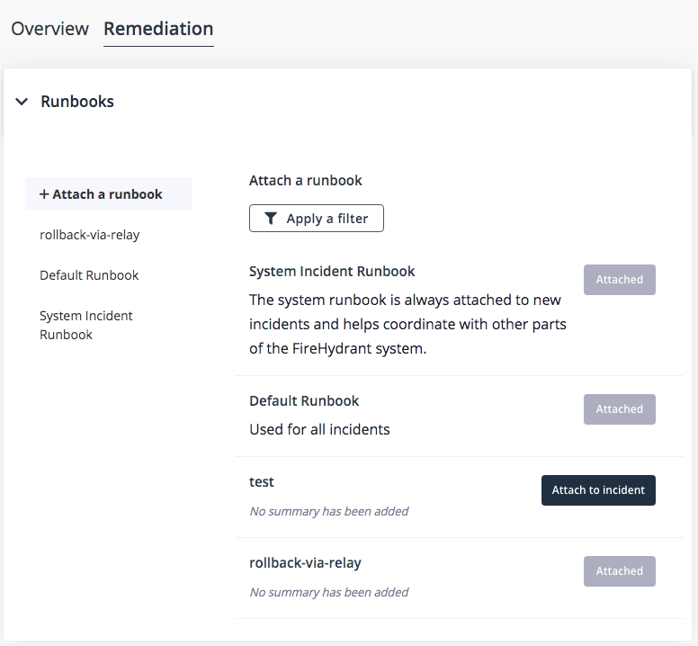
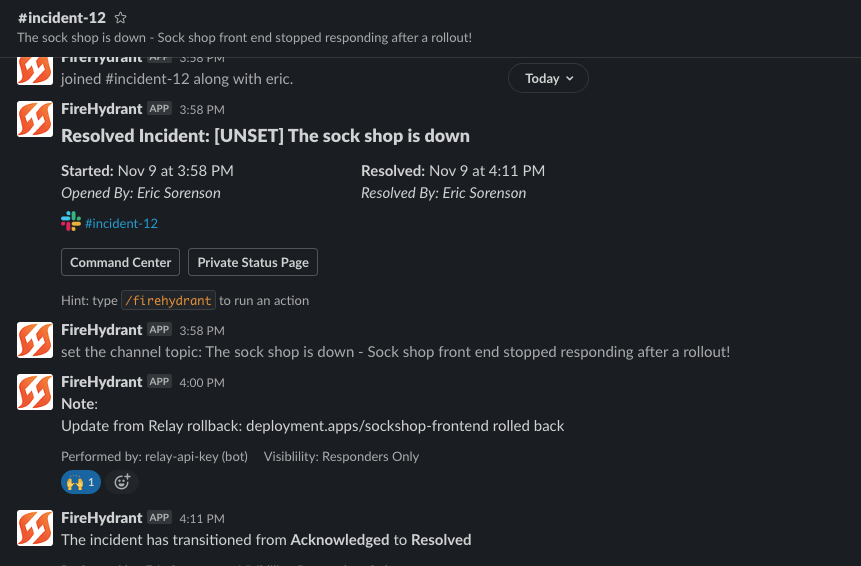

[FireHydrant](https://firehydrant.io) has a sophisticated set of response actions for coordinating communications, activities, and retrospectives for incidents that affect your services. [Relay](https://relay.sh) helps by automating remediations that involve orchestrating actions across your infrastructure. In this example workflow, an incident that affects an application deployed on Kubernetes can trigger a rollback to a previous version automatically.



The workflow makes a couple of assumptions about your infrastructure that will need to be true to work out of the box; we'd [love to work with you](https://github.com/puppetlabs/relay/issues/new) if you need additional flexibility! Specifically, it maps FireHydrant "Services" to Kubernetes [deployments](https://cloud.google.com/kubernetes-engine/docs/concepts/deployment), and FireHydrant Environments to Kubernetes [namespaces](https://kubernetes.io/docs/concepts/overview/working-with-objects/namespaces/). Your deployment and rollback process is likely different from the one modelled here, but this should provide a good starting point for automating incident response activity with Relay.

## Connecting the Services

In order to enable two-way communication between FireHydrant and Relay, we'll need to do some work on both sides: Relay posting to FireHydrant requires a FireHydrant API key, and FireHydrant triggering Relay workflows uses a dynamically-generated Relay webhook URL.

First, add the Relay workflow to your account [using this link](https://app.relay.sh/create-workflow?workflowName=firehydrant-rollback&initialContentURL=https%3A%2F%2Fraw.githubusercontent.com%2Fpuppetlabs%2Frelay-workflows%2Fmaster%2Ffirehydrant-rollback%2Ffirehydrant-rollback.yaml). When you click "Save", Relay will both create the webhook URL you'll need and prompt that you're missing a Secret and a Connection - we'll get to those in a moment.

In FireHydrant, we'll create a Runbook that will trigger the workflow by sending a webhook to Relay. Create a new Runbook and add a **Send a Webhook** step. For the **Endpoint URL**, paste the webhook address from the Relay's **Settings** sidebar. The **HMAC Secret** field is an arbitrary string (not currently used). For the **JSON Payload** field, paste the following template:

```json
{
  "incident_id": "{{ incident.id }}",
  "name": "{{ incident.name }}",
  "summary": "{{ incident.summary }}",
  "service": "{{ incident.services[0].name | downcase }}",
  "environment": "{{ incident.environments[0].name | downcase }}",
  "channel_id": "{{ incident.channel_id }}",
  "channel_name": "{{ incident.channel_name }}"
}
```

Next, create a FireHydrant API key for Relay to post information back into the incident timeline. Under **Integrations** - **Bot users** in FireHydrant, create a new **Bot user** with a memorable name and description. Save the resulting API token into a Relay secret on the Relay workflow's **Settings** sidebar named `apiKey` (case-sensitive).



## GCP Authentication Setup

This workflow uses a GCP Connection type on Relay's end, which requires a [service account](https://kubernetes.io/docs/reference/access-authn-authz/authentication/#service-account-tokens)
configured on your cluster. Follow the GCP guide to API Server Authentication's ["Service in other environments"](https://cloud.google.com/kubernetes-engine/docs/how-to/api-server-authentication#service_in_other_environments) section to set one up. This workflow will require the service account have the role `roles/container.developer` attached to it; if you re-use the connection for other workflows it may require additional permissions. Once you've gotten the service account JSON file downloaded, add a GCP Connection in Relay, name it `relay-service-account` and paste the contents of the JSON file into the dialog. Under the hood, Relay stores this securely in our Vault service and makes the contents available to workflow containers through the [!Connection custom type](https://relay.sh/docs/using-workflows/managing-connections/) in the workflow. 



For non-GCP clusters, you can use Relay's Kubernetes connection type, which requires less setup. GCP rotates access tokens every hour, making them unsuitable for automated use. The Kubernetes connection type needs an access token, the cluster URL, and the CA certificate for the cluster; there are more detailed instructions accompanying[this deployment workflow example](https://github.com/puppetlabs/relay-workflows/tree/master/kubectl-apply-on-dockerhub-push).

## Configuring Services and Environments

One of the FireHydrant's big benefits is its awareness of your infrastructure. It takes a little bit of up-front work, but if you invest the time to map out your services and environments, you can dramatically streamline your incident response. In this example, we've enumerated the microservices that make up our Sock Shop application and associated them with different runbooks. Fortunately for the demo, the `sockshop-frontend` service is a simple stateless Deployment in GKE, which makes new releases easy to manage with the `kubectl rollout` command. 



Similarly, the Environments section lets you enumerate the instances of your service, to better characterize the impact of an incident, help assign owners for remediation actions, and message outage information to the appropriate audiences. Check out this FireHydrant [helpdesk article on inventory management](https://help.firehydrant.io/en/articles/4192249-inventory-management-functionalities-services-and-environments) for more details on infrastructure organization. For our purposes, the goal of defining environments is to map them onto Kubernetes namespaces where our application is running. (For production workloads, it's more likely that your environments map to distinct clusters; that's totally possible to handle in Relay but is beyond the scope of this introduction!) 



## Incident Creation and Response

Now for the exciting part. Let's say an update bumped the image on the frontend pods from a pinned version to `latest` and everything broke.

```
% kubectl set image deployment/sockshop-frontend nginx-1=nginx:latest \
   --record --namespace production deployment.apps/sockshop-frontend 
image updated
% kubectl rollout history deployment sockshop-frontend --namespace production
deployment.apps/sockshop-frontend
REVISION  CHANGE-CAUSE
1         kubectl set image deployment/sockshop-frontend nginx:1.18.0=nginx:latest --record=true --namespace=production
2         kubectl set image deployment/sockshop-frontend nginx-1=nginx:latest --record=true --namespace=production
```

But unbeknownst to the deployer, all was not well. After some troubleshooting, we determined that the application was degraded and rollout was to blame. In FireHydrant, the on-call person declares an incident and indicates the service and environment that were affected.



Once the incident is created, we can attach the `rollback-via-relay` Runbook that contains our webhook to the incident. The benefit of doing it this way is that the credentials are stored in Relay rather than needing a comamnd-line `kubectl` setup as above, and you don't have to remember the exact syntax to type if something's broken at 4AM! The correct steps are stored in the workflow, reducing the possibility for an error.



The incident timeline and associated Slack channel show these action taking place, and in Relay we can see the webhook come in, the workflow kick off, and ultimately post back into the timeline with the output of the rollback command. Thanks to FireHydrant's [awesome Slack integration](https://help.firehydrant.io/en/articles/2862753-integrating-with-slack), the updates roll into the channel in real time and chat messages are mirrored back into the incident so teams can coordinate their activities and keep a record of what happened. In this case, the rollback worked and we can resolve the issue quickly!



## Conclusion and Next Steps

FireHydrant's Runbook based system for coordinating actions in response to incidents is extremely powerful. The more you teach it about your infrastructure, the faster you'll be able to respond when something goes wrong. And linking it to Relay via Runbooks enables another level of automated response and remediation. In this example, we were able to roll back a deployment without someone needing to run manual commands and potentially making things worse!

There are lots of [existing Relay workflows](https://relay.sh/workflows/) that can act as building blocks or examples to construct your own incident response workflow. By combining them with clear processes codified in FireHydrant, responders can solve issues more quickly, reduce downtime, and get back to higher-value work. 

To try this out for yourself, sign up for free [FireHydrant](https://firehydrant.io) account and [Relay](https://relay.sh) accounts, and get started automating!
